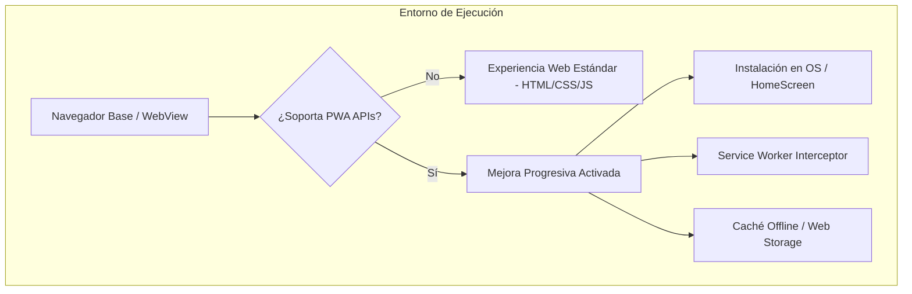
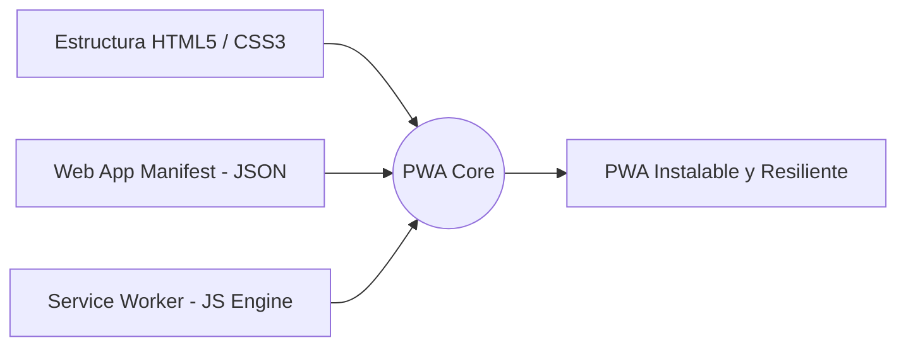
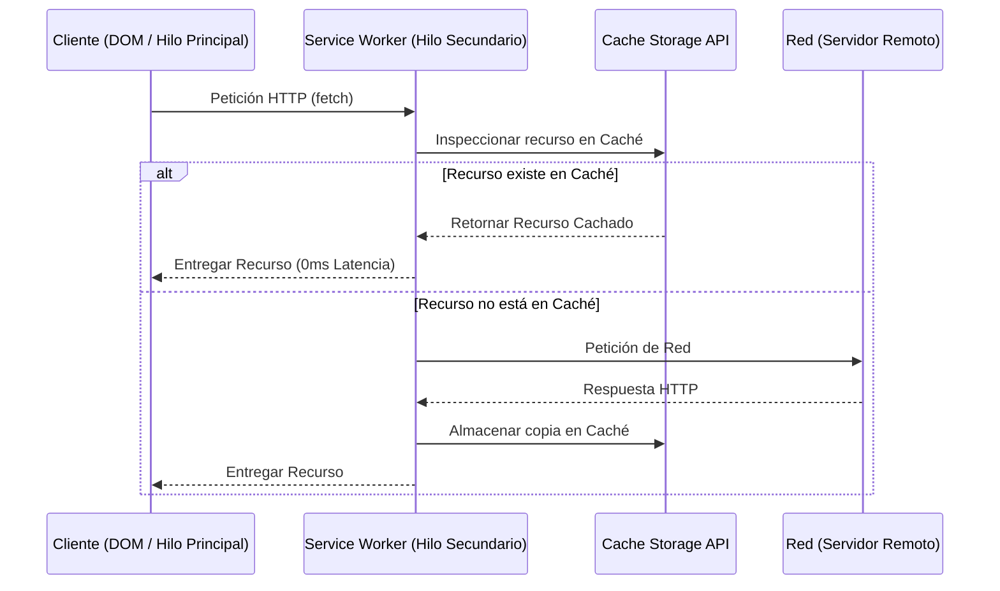
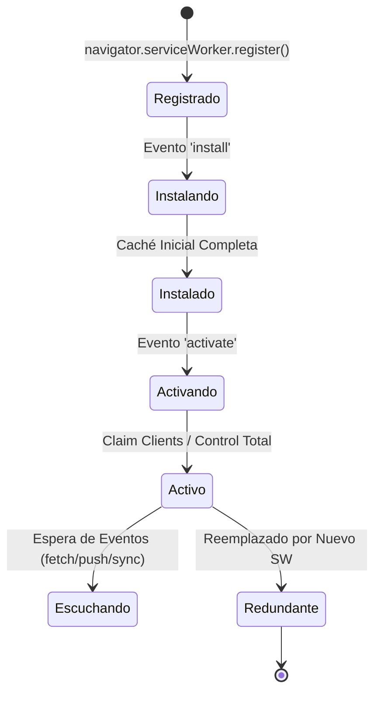
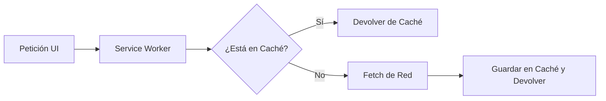
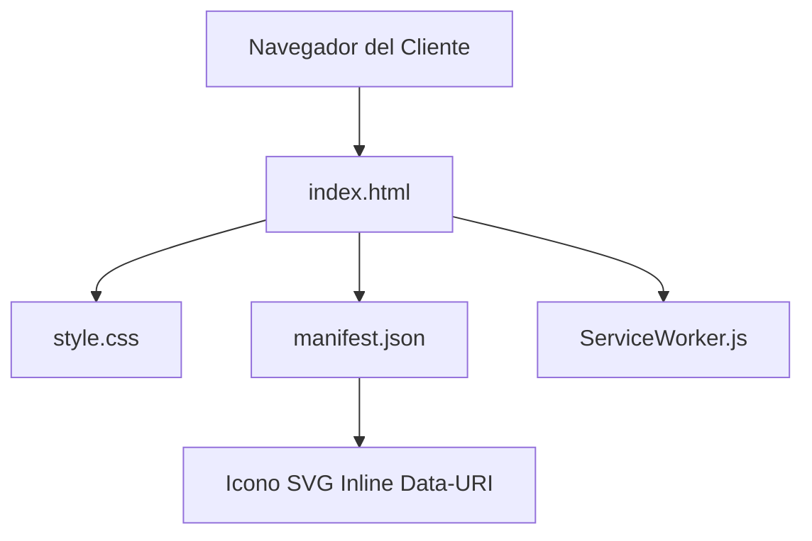
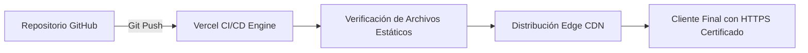

# Informe de Ingeniería de Software: Arquitectura, Componentes y Despliegue de Aplicaciones Web Progresivas (PWA)

## 1. Introducción y Definición Técnica
Una **Aplicación Web Progresiva** (PWA, por sus siglas en inglés *Progressive Web App*) es un patrón de diseño y desarrollo de software que utiliza capacidades web modernas para ofrecer una experiencia de usuario equivalente o superior a la de una aplicación nativa móvil o de escritorio.

A diferencia de las aplicaciones nativas tradicionales, que dependen de sistemas operativos específicos (iOS, Android, Windows) y se distribuyen exclusivamente a través de tiendas de aplicaciones propietarias, una PWA se ejecuta dentro del motor de renderizado del navegador web, pero se desacopla visualmente de la interfaz del navegador (*browser chrome*) mediante la ejecución en un contexto de pantalla completa (*standalone*).

El término **"Progresiva"** hace referencia al principio fundamental de **Mejora Progresiva** (*Progressive Enhancement*): la aplicación debe funcionar de manera básica e ininterrumpida en cualquier navegador web o dispositivo antiguo, pero habilitar de forma transparente características avanzadas (instalabilidad, ejecución fuera de línea, sincronización en segundo plano y notificaciones push) cuando el motor del navegador subyacente soporte las API modernas del W3C.



---

## 2. Pilares Tecnológicos y Componentes Fundamentales
La arquitectura de una PWA se sostiene sobre tres pilares normativos e independientes que deben coexistir de manera armónica en el sistema de archivos:



### 2.1. El Manifiesto de la Aplicación Web (`manifest.json`)
Es un archivo de configuración en formato JSON declarativo que le proporciona al sistema operativo del dispositivo la metadata necesaria para registrar la PWA como una aplicación de primer nivel. Define cómo debe comportarse la aplicación cuando es lanzada desde la pantalla de inicio o el menú de aplicaciones del dispositivo.

* **`name` / `short_name`:** Define la identidad del sistema. `name` se utiliza en diálogos de instalación, mientras que `short_name` se despliega bajo el icono en la pantalla de inicio.
* **`start_url`:** La ruta relativa o absoluta que debe cargar la PWA al ser abierta.
* **`display`:** Controla la visibilidad de la interfaz del navegador.
  * `fullscreen`: Oculta toda la interfaz del SO y del navegador.
  * `standalone`: Oculta la barra de navegación del explorador, manteniendo la barra de estado del sistema operativo (comportamiento nativo estándar).
  * `minimal-ui`: Conserva un conjunto reducido de controles de navegación.
  * `browser`: Se comporta como una pestaña estándar.
* **`background_color` y `theme_color`:** Definen el color de la pantalla de carga (*splash screen*) y el color de la barra de estado del sistema operativo, respectivamente.
* **`icons`:** Arreglo de objetos que especifican los recursos gráficos para los accesos directos. En arquitecturas minimalistas, se utiliza un único vector **SVG puro** codificado en `data:image/svg+xml` para garantizar escalabilidad infinita y cero peticiones de red adicionales.

### 2.2. El Service Worker (`ServiceWorker.js`)
Un **Service Worker** es un script de JavaScript que el navegador ejecuta en segundo plano, completamente separado del hilo principal de ejecución del DOM (*Document Object Model*). Actúa como un **servidor proxy programable** situado entre la aplicación web, la red y la caché del navegador.



#### Propiedades Técnicas del Service Worker:
1. **Sin acceso al DOM:** No puede manipular directamente elementos HTML. La comunicación con el hilo principal se realiza mediante la API `postMessage`.
2. **Ciclo de Vida Independiente:** Pasa por estados estrictamente definidos: *Registro* -> *Instalación* -> *Activación* -> *Inactividad/Escucha*.
3. **Seguridad HTTPS Obligatoria:** Debido a su capacidad para interceptar peticiones de red y modificar respuestas, los navegadores exigen que el sitio sea servido bajo un protocolo cifrado (TLS/HTTPS), con la única excepción del entorno de desarrollo local (`localhost`).

### 2.3. Contexto Seguro y HTTPS
La infraestructura de red subyacente para cualquier PWA requiere un canal de transporte seguro para evitar ataques de manipulación de datos en tránsito (*Man-in-the-Middle*). Plataformas de despliegue automatizado como Vercel o GitHub Pages proveen certificados TLS automáticamente.

---

## 3. Ciclo de Vida del Service Worker
El Service Worker opera bajo un ciclo de vida riguroso controlado por el navegador para garantizar que las versiones antiguas de los scripts no corrompan la integridad de la aplicación.



1. **Registro:** El hilo principal ejecuta `navigator.serviceWorker.register('./ServiceWorker.js')`.
2. **Instalación (`install`):** Se dispara una vez que el script es descargado. Es el momento preciso para precachar recursos estáticos críticos (*App Shell*). Mediante `self.skipWaiting()`, se puede forzar al nuevo Service Worker a activarse sin esperar a que el usuario cierre todas las pestañas activas.
3. **Activación (`activate`):** Se ejecuta cuando el Service Worker toma el control. Es la etapa donde se purgan cachés obsoletas de versiones anteriores utilizando `self.clients.claim()`.
4. **Escucha de Eventos (`fetch`):** El trabajador entra en estado de reposo y despierta únicamente cuando se realiza una petición de red, se recibe una notificación push o se ejecuta un evento de sincronización en segundo plano.

---

## 4. Estrategias de Caching e Intercepción de Red
El Service Worker permite implementar patrones de arquitectura de red personalizados interceptando el evento `fetch`. Las estrategias fundamentales son:

### 4.1. Cache First (Cache Primero, Caída a Red)
La petición busca primero en la caché. Si el recurso está almacenado, se entrega inmediatamente sin tocar la red. Si no existe, se realiza la petición HTTP y se guarda el resultado para futuras peticiones.
* **Uso recomendado:** Recursos estáticos inmutables (fuentes, iconos SVG, hojas de estilo CSS).



### 4.2. Network First (Red Primero, Caída a Caché)
Intenta obtener la información más reciente desde el servidor remoto. Si la red falla o está fuera de línea, responde con la copia guardada previamente en la caché.
* **Uso recomendado:** Datos dinámicos, feeds de noticias, datos de perfil que requieren frescura.

### 4.3. Stale-While-Revalidate (Obsoleto mientras Revalida)
Devuelve inmediatamente la versión en caché para garantizar latencia cero en la interfaz de usuario, pero simultáneamente lanza una petición de red en segundo plano para actualizar la caché con la versión más reciente para el próximo uso.
* **Uso recomendado:** Contenido de actualización frecuente donde la velocidad de carga es la prioridad absoluta.

### 4.4. Network Only / Cache Only
Estrategias puras que no combinan fuentes. `Network Only` es para transacciones no cachables (como pagos POST), y `Cache Only` para entornos aislados (*offline-first* estrictos).

---

## 5. Criterios de Instalabilidad (PWA Checklists del W3C)
Para que un navegador móvil o de escritorio identifique una web como instalable y despliegue el mensaje o botón de **"Añadir a la pantalla de inicio"** (*Install Prompt*), el software debe cumplir estrictamente con los siguientes requisitos normativos:

1. **Protocolo Seguro:** Servido sobre HTTPS válido o `localhost`.
2. **Manifiesto Válido:** `manifest.json` enlazado en el `<head>` mediante `<link rel="manifest" href="...">`.
3. **Propiedades del Manifiesto Cumplidas:** Debe incluir `name`, `short_name`, `start_url`, `display` (en `standalone` o `fullscreen`) y al menos un icono funcional.
4. **Service Worker Registrado:** Debe haber un Service Worker activo con un controlador de eventos `fetch` declarado.
5. **Interacción del Usuario:** El navegador evalúa métricas de retención e interacción previa del usuario antes de emitir el evento `beforeinstallprompt`.

---

## 6. Arquitectura de Código de la Plantilla (`plantilla-pwa-launcher`)
A continuación se documenta el código base de la plantilla con separación estricta de responsabilidades, optimizada para rendimiento extremo y cero dependencias de bibliotecas externas.



### 6.1. Interfaz y Registro (`index.html`)
Punto de entrada de la aplicación. Declara el viewport, la vinculación del manifiesto, la inyección directa de elementos gráficos SVG y el script de inicialización del Service Worker.

```html
<!DOCTYPE html>
<html lang="es">
<head>
  <meta charset="UTF-8">
  <meta name="viewport" content="width=device-width, initial-scale=1.0">
  <title>Mi Galería - PWA Launcher</title>
  <meta name="theme-color" content="#0d0d0d">
  <link rel="stylesheet" href="style.css">
  <link rel="manifest" href="manifest.json">
</head>
<body>

  <main class="container">
    <a href="[https://instagram.com/mi_galeria2026](https://instagram.com/mi_galeria2026)" target="_blank" rel="noopener noreferrer" aria-label="Abrir Galería" class="icon-link">
      <svg xmlns="[http://www.w3.org/2000/svg](http://www.w3.org/2000/svg)" viewBox="0 0 448 512" class="instagram-svg">
        <path d="M224.1 141c-63.6 0-114.9 51.3-114.9 114.9s51.3 114.9 114.9 114.9S339 319.5 339 255.9 287.7 141 224.1 141zm0 189.6c-41.1 0-74.7-33.5-74.7-74.7s33.5-74.7 74.7-74.7 74.7 33.5 74.7 74.7-33.6 74.7-74.7 74.7zm146.4-194.3c0 14.9-12 26.8-26.8 26.8-14.9 0-26.8-12-26.8-26.8s12-26.8 26.8-26.8 26.8 12 26.8 26.8zm76.1 27.2c-1.7-35.9-9.9-67.7-36.2-93.9-26.2-26.2-58-34.4-93.9-36.2-37-2.1-147.9-2.1-184.9 0-35.8 1.7-67.6 9.9-93.9 36.1s-34.4 58-36.2 93.9c-2.1 37-2.1 147.9 0 184.9 1.7 35.9 9.9 67.7 36.2 93.9s58 34.4 93.9 36.2c37 2.1 147.9 2.1 184.9 0 35.9-1.7 67.7-9.9 93.9-36.2 26.2-26.2 34.4-58 36.2-93.9 2.1-37 2.1-147.8 0-184.8zM398.8 388c-7.8 19.6-22.9 34.7-42.6 42.6-29.5 11.7-99.5 9-132.1 9s-102.7 2.6-132.1-9c-19.6-7.8-34.7-22.9-42.6-42.6-11.7-29.5-9-99.5-9-132.1s-2.6-102.7 9-132.1c7.8-19.6 22.9-34.7 42.6-42.6 29.5-11.7 99.5-9 132.1-9s102.7-2.6 132.1 9c19.6 7.8 34.7 22.9 42.6 42.6 11.7 29.5 9 99.5 9 132.1s2.7 102.7-9 132.1z"/>
      </svg>
    </a>
  </main>

  <script>
    if ('serviceWorker' in navigator) {
      window.addEventListener('load', () => {
        navigator.serviceWorker.register('./ServiceWorker.js')
          .then(reg => console.log('Service Worker registrado con éxito:', reg.scope))
          .catch(err => console.error('Error al registrar Service Worker:', err));
      });
    }
  </script>
</body>
</html>
```

### 6.2. Hoja de Estilos Minimalista (`style.css`)
Estilos con reseteo absoluto, diseño adaptativo centrado mediante *Flexbox* y optimización ergonómica para interacción táctil en dispositivos móviles.

```css
* {
  box-sizing: border-box;
  margin: 0;
  padding: 0;
}

body {
  width: 100vw;
  height: 100vh;
  background-color: #0d0d0d;
  display: flex;
  align-items: center;
  justify-content: center;
  overflow: hidden;
  font-family: -apple-system, BlinkMacSystemFont, "Segoe UI", Roboto, sans-serif;
}

.container {
  display: flex;
  align-items: center;
  justify-content: center;
}

.icon-link {
  color: #e8e8e8;
  display: inline-block;
  text-decoration: none;
  transition: transform 0.15s ease, color 0.15s ease;
}

.icon-link:active {
  transform: scale(0.92);
  color: #ffffff;
}

.instagram-svg {
  width: 100px;
  height: 100px;
  fill: currentColor;
}
```

### 6.3. Configuración PWA e Iconografía (`manifest.json`)
Manifiesto declarativo con vectorización directa en Data-URI para eliminar peticiones a recursos gráficos externos durante la fase de instalación.

```json
{
  "name": "Mi Galería",
  "short_name": "Galería",
  "start_url": "/",
  "display": "standalone",
  "background_color": "#0d0d0d",
  "theme_color": "#0d0d0d",
  "icons": [
    {
      "src": "data:image/svg+xml;charset=utf-8,%3Csvg%20xmlns%3D%22http%3A%2F%2Fwww.w3.org%2F2000%2Fsvg%22%20viewBox%3D%220%200%20448%20512%22%3E%3Cpath%20fill%3D%22%23e8e8e8%22%20d%3D%22M224.1%20141c-63.6%200-114.9%2051.3-114.9%20114.9s51.3%20114.9%20114.9%20114.9S339%20319.5%20339%20255.9%20287.7%20141%20224.1%20141zm0%20189.6c-41.1%200-74.7-33.5-74.7-74.7s33.5-74.7%2074.7-74.7%2074.7%2033.5%2074.7%2074.7-33.6%2074.7-74.7%2074.7zm146.4-194.3c0%2014.9-12%2026.8-26.8%2026.8-14.9%200-26.8-12-26.8-26.8s12-26.8%2026.8-26.8%2026.8%2012%2026.8%2026.8zm76.1%2027.2c-1.7-35.9-9.9-67.7-36.2-93.9-26.2-26.2-58-34.4-93.9-36.2-37-2.1-147.9-2.1-184.9%200-35.8%201.7-67.6%209.9-93.9%2036.1s-34.4%2058-36.2%2093.9c-2.1%2037-2.1%20147.9%200%20184.9%201.7%2035.9%209.9%2067.7%2036.2%2093.9s58%2034.4%2093.9%2036.2c37%202.1%20147.9%202.1%20184.9%200%2035.9-1.7%2067.7-9.9%2093.9-36.2%2026.2-26.2%2034.4-58%2036.2-93.9%202.1-37%202.1-147.8%200-184.8zM398.8%20388c-7.8%2019.6-22.9%2034.7-42.6%2042.6-29.5%2011.7-99.5%209-132.1%209s-102.7%202.6-132.1-9c-19.6-7.8-34.7-22.9-42.6-42.6-11.7-29.5-9-99.5-9-132.1s-2.6-102.7%209-132.1c7.8-19.6%2022.9-34.7%2042.6-42.6%2029.5-11.7%2099.5-9%20132.1-9s102.7-2.6%20132.1%209c19.6%207.8%2034.7%2022.9%2042.6%2042.6%2011.7%2029.5%209%2099.5%209%20132.1s2.7%20102.7-9%20132.1z%22%2F%3E%3C%2Fsvg%3E",
      "sizes": "512x512",
      "type": "image/svg+xml"
    }
  ]
}
```

### 6.4. Servidor Proxy y Control de Caché (`ServiceWorker.js`)
Service Worker estático que gestiona el ciclo de vida sin bloquear el rendimiento y toma el control inmediato de los clientes en la red.

```javascript
// Nombre de la versión del almacenamiento en caché
const CACHE_NAME = 'pwa-launcher-v1';

// Recursos críticos para el funcionamiento fuera de línea
const ASSETS_TO_CACHE = [
  './',
  './index.html',
  './style.css',
  './manifest.json'
];

// Evento de Instalación: Carga en caché del App Shell
self.addEventListener('install', (event) => {
  event.waitUntil(
    caches.open(CACHE_NAME)
      .then((cache) => {
        return cache.addAll(ASSETS_TO_CACHE);
      })
      .then(() => self.skipWaiting())
  );
});

// Evento de Activación: Limpieza de cachés antiguas y toma de control
self.addEventListener('activate', (event) => {
  event.waitUntil(
    caches.keys().then((cacheNames) => {
      return Promise.all(
        cacheNames.map((cache) => {
          if (cache !== CACHE_NAME) {
            return caches.delete(cache);
          }
        })
      );
    }).then(() => self.clients.claim())
  );
});

// Evento Fetch: Estrategia Stale-While-Revalidate
self.addEventListener('fetch', (event) => {
  event.respondWith(
    caches.match(event.request).then((cachedResponse) => {
      const fetchPromise = fetch(event.request).then((networkResponse) => {
        if (networkResponse && networkResponse.status === 200 && networkResponse.type === 'basic') {
          const responseToCache = networkResponse.clone();
          caches.open(CACHE_NAME).then((cache) => {
            cache.put(event.request, responseToCache);
          });
        }
        return networkResponse;
      }).catch(() => {
        // Retorno silencioso si falla la red y no hay caché
      });

      return cachedResponse || fetchPromise;
    })
  );
});
```

---

## 7. Ventajas y Limitaciones de la Arquitectura PWA
El diseño de software debe evaluar los compromisos (*trade-offs*) antes de seleccionar una PWA sobre un desarrollo nativo.

### Ventajas Competitivas
1. **Multiplataforma Real:** Un solo código fuente funciona simultáneamente en Android, iOS, Windows, macOS y Linux.
2. **Actualización Continua:** No requiere aprobación de tiendas externas (App Store / Play Store). La actualización del Service Worker despliega la nueva versión instantáneamente a todos los usuarios.
3. **Consumo de Recursos Mínimo:** La arquitectura desacoplada y los vectores SVG permiten empaquetar aplicaciones completas en un tamaño total inferior a los 100 KB (comparado con los 50 MB a 200 MB de aplicaciones nativas).
4. **Independencia de Conectividad:** La aplicación funciona en redes inestables o completamente desconectadas mediante las políticas de almacenamiento en la Cache Storage API.

### Limitaciones de Hardware y Plataforma
1. **Acceso Restringido a APIs del Sistema:** Ciertas características avanzadas de hardware (NFC, escaneo Bluetooth de bajo nivel, geofencing avanzado, acceso a contactos del sistema) tienen soporte limitado o nulo según el motor del navegador (especialmente en WebKit / iOS Safari).
2. **Uso de Memoria:** Al ejecutarse dentro de un entorno sandbox de navegador, el rendimiento de cómputo gráfico intensivo (3D pesado) o procesamiento de archivos masivos es inferior al de un ejecutable compilado a código máquina nativo.

---

## 8. Guía de Despliegue en Vercel
La plataforma Vercel proporciona una infraestructura sin servidor (*Serverless*) optimizada para la distribución de activos estáticos y PWA sobre una red CDN global.



### Pasos de Despliegue:
1. Sincronizar el código base en un repositorio privado o público de GitHub.
2. Acceder al panel de Vercel y seleccionar **"Add New Project"**.
3. Importar el repositorio correspondiente.
4. En la configuración de construcción (*Build & Output Settings*), seleccionar el framework como **"Other"** (ficheros estáticos puros).
5. Confirmar el despliegue (**Deploy**). En menos de 5 segundos, la PWA estará disponible globalmente en un dominio `.vercel.app` con SSL cifrado y soporte nativo para instalación PWA.


-----------------------------------------------------------------------------------------------------------------------------------------------------------------------

## Anexo A: Arquitectura Ultraliviana (Zero-App-JS Pattern)

En arquitecturas orientadas a rendimiento extremo y mínimo consumo de recursos, es posible prescindir totalmente de un script de lógica principal en el cliente (`app.js` o frameworks JS).

### A.1. Separación de Responsabilidades

| Componente | Rol en Arquitectura Ultraliviana | Obligatoriedad |
| :--- | :--- | :--- |
| **HTML5 / CSS3** | Interfaz, diseño responsivo, estados visuales (`:checked`, `:hover`, `:target`) y animaciones puras. | **Obligatorio** |
| **`manifest.json`** | Registra la PWA en el sistema operativo (icono SVG inyectado, colores de tema, modo `standalone`). | **Obligatorio** |
| **`ServiceWorker.js`** | Único punto de ejecución JavaScript. Gestiona almacenamiento en caché, intercepción de red y soporte fuera de línea. | **Obligatorio** |
| **`app.js` / Lógica UI** | Manipulación del DOM y lógica cliente. | **Opcional (Eliminado)** |

### A.2. Fundamento Técnico
El estándar PWA de la W3C no exige código JavaScript para la capa de presentación. Al resolver la interactividad visual mediante CSS puro y delegar el comportamiento progresivo exclusivamente al Service Worker, se logran tres ventajas estructurales:

1. **Cero Deuda Técnica:** Sin dependencias de terceros ni compiladores.
2. **Carga Inmediata:** Se elimina el tiempo de parseo y ejecución del hilo principal de JS (*Main Thread Blocking*).
3. **Escalabilidad y Portabilidad:** Ideal para micro-proyectos de alto impacto y bajo consumo (Tarjetas Digitales, Reproductores de Radio Online, Landing Pages y Accesos Directos PWA).
